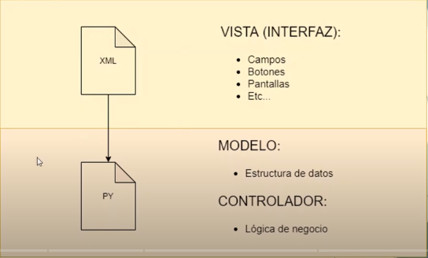
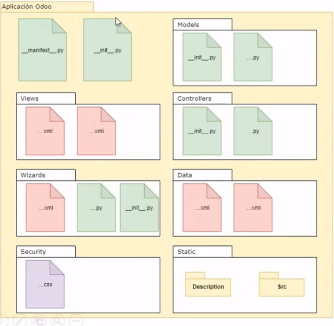
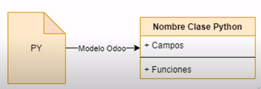
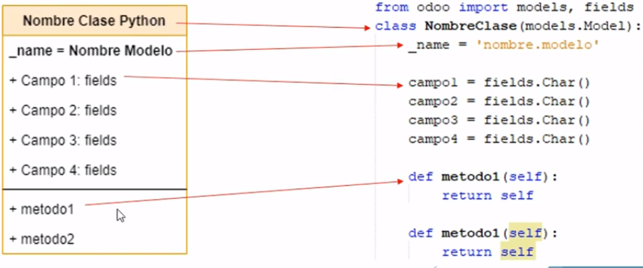
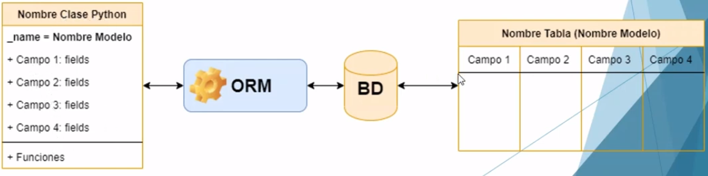

# Odoo_New

<h2>Content List</h2>

- [Qué se Debe Saber del DESARROLLO Odoo](#qué-se-debe-saber-del-desarollo-odoo)
- [Arquitectura y Estructura básica de una app en Odoo](#arquitectura-y-estructura-básica-de-una-app-en-odoo)
- [Módelos Python para Aplicaciones Odoo](#módelos-python-para-aplicaciones-odoo)

## Qué se debe saber del DESAROLLO Odoo 

* ¿Qué hace un desarrollador Odoo?

    * Aplicaciones y /o funcionalidades nuevas: Crear un módulo nuevo con funcionalidades nuevas en el ERP 
    * Adecuación y/o ajustes a funcionalidades existentes: Ya viene empaquetado con ciertas funcionalidades, es decir que de acuerdo a un requimrimiento se realicen cambio a las funcionalidades de ese módulo 
    * Corrección de errores: Es muy probable que algún desarrollo no funcione correctamente. 
    * Reportes 

* ¿Qué conocimientos se necesita?

    * Saber programar y/o tener lógica de programación 
    * No se requiere conocer o dominar python 

* Conocimiento básico de SQL y base de datos
    
    * En Odoo rara vez se requerirá una consulta SQL 
    * Dominar la lógica en las sentencias SQL te ayudará a entender los dominios en Odoo. 

* Lenguajes de programación que se utilizamn

    * Python
    * Xml
    * Javascript

    * Otros no tan usados
        
        * CSS
        * HTML

* La base de datos que se utiliza es PostgreSQL

* Se utiliza el ORM de Odoo para la interacción con la base de datos

* Sistema Operativo con Linux en alguna de sus distribuciones

    * Ubuntu 20.04 o superiores

* Editor de código o IDE

    * Visual Studio Code

*  Repositorio para control de versiones de código: GITHUB

* Compatibilidad con navegadores web

<h3>Consejos</h3>

* Seguir las buenas prácticas de programación 
* Sigue los lineamientos para desarrollar en Odoo 
* Conoce y aplica las convenciones de programación para python y Javascript
* Apoyate del código estándar para realizar el tuyo
* Versiona tu código con la ayuda de GitHub
* Entiende y comprende los conceptos básicos: Modelos, Campos, Vistas, Widgets
* Practica para fortalecer tu habilidad de desarrollo 
* Mantente actualizado con las nuevas novedades, versiones, widgtres, etc de Odoo 
* Sé autodidacta pero no dejes de formarte
* Capacitate

## Arquitectura y Estructura básica de una app en Odoo 

<h3>Composición de un módulo</h3>

* Objetos de negocio. Declaradas con clases Python
* Vistas de objetos: Visualización de la interfaz de usuario, declardos con archivos XML. 
* Archivos de información. 
    * Informes
    * Datos de configuración 
    * Datos de demostración
    * Y más... 
* Controladores web: Maneja solicitudes de nacegadores web 
* Datos web estáticos. Utilizados por el sitio o interfaz web 
    * Imágenes
    * Archivos CSS 
    * Javascript

<h3>Arquitectura similar a MVC</h3>

<p align="center"></p>

<h3>Estructura de una Aplicación Odoo</h3>

<p align="center"></p>

<h3>Archivo __init__.py</h3>

En este archivo se indicará donde se encuentran los archivos .py 

El archivo init se verá así 

```python
from . import controllers
from . import models
from . import wizards
```

Controllers, models y wizards son carpetas que creamos en nuestro proyecto. 

Dentro de las carpetas, también existe un fichero __ init __.py Y este fichero hace exactamante lo mismo, sólo que dentro de esa carpeta, es decir localiza los archivos .py e importa todos los registros que estén dentro de esa carpeta. 

<h3>Archivo __manifest__.py</h3>

Se encuentra en la carpeta principal  y nos indica donde se encuentran los archivos xml, csv y otras fuentes.

**¿Para qué sirve?**

Ene ste archivo podemos hacer la declaración de módulo y especificación de metadatos del módulo, como por ejemplo, el nombre de la alicación, descripción, sitio web de creador y de autor, versión de la aplicación del módulo, la dependencia con otros módulos, fuentes: vistas, datos, imágenes; licencia, etc. 

## Módelos Python para Aplicaciones Odoo 

<h3> Objetos de Negocio: Modelos Odoo </h3>

* Los módelos decriben objetos de negocio: Clientes, proveedores, productos, compras, etc 
* Cada modelo en odoo es declarado como una clase en python. 
* Un modelo tiene una lista de atributos y también puede definir su propia lógica de negocio. 

<p align="center"></p>

<h3>Estructura de un Modelo</h3>

* La clase se define con **class** y se utiliza mayúscula al principio de cada palabra. 
* El nommbre del modelo se define con **_name**.
* Los campos se definen con **fields**
* Los campos se definen como atributos en la clase del modelo y definen qué puede almacenar el modelo y dónde. 

<p align="center"></p>

De acuerdo al código, tenemos: 

```python
from odoo import models, fields     #Para lograr acceso a los componentes del models 

class NombreClase(models.Model):    #Declaración de la clase y se declara que sea de tipo model
    _name = 'nombre.modelo'         #Nombre del módelo

    campo1 = fields.Char()          #Campos que están dentro del módelo 
    campo2 = fields.Char()
    campo3 = fields.Char()
    campo4 = fields.Char()

    def metodo1(self):              #Finalmente, declaramos los métodos del módelo
        return self

    def metodo2(self)
        return self
```

<h3>Persistencia de datos en los Modelos</h3>

* En Odoo existe una capa de Mapeo de Objeto-Relación o ORM por sus siglas en inglés 
* El ORM de Odoo traduce instrucciones python a sentencias SQL. 
* el ORM evita escribir la mayoría de sentencias SQL y proporciona servicios de extensibilidad y seguridad
* El modelo se convierte en una tabla
* Los campos se convierten en columnas de una tabla. 

<p align="center"></p>

<h3>Tipos de Modelo</h3>

* Los módelos de Odoo se crean heredando a ***Model,TransientModel*** o ***AbstractModel***
    * Model: Modelos regulares de BD persistentes. 
    * TransientModel: Datos temporales, almacenados en BD y automáticamente borrados de vez en cuando. 
    * AbstractModel: Sin tablas de BD vinculados a ellos. Compartidas por múltiples modelos heredados. 


