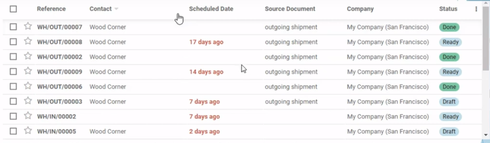
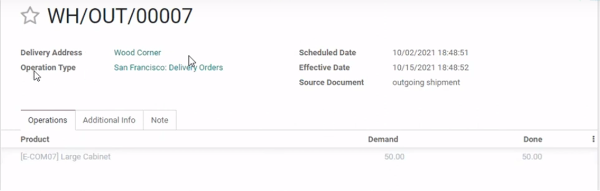
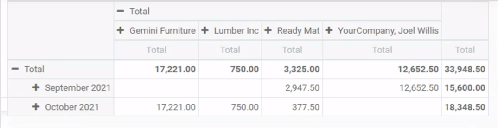
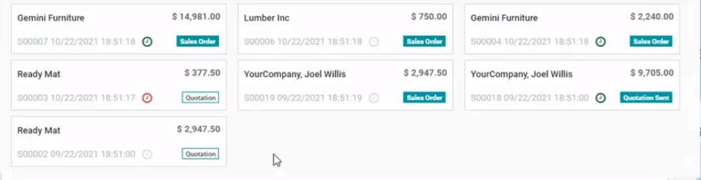
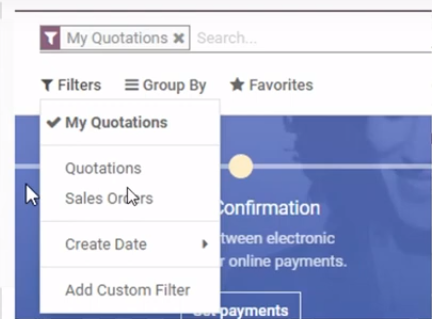
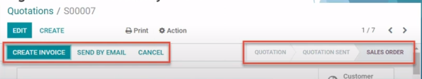
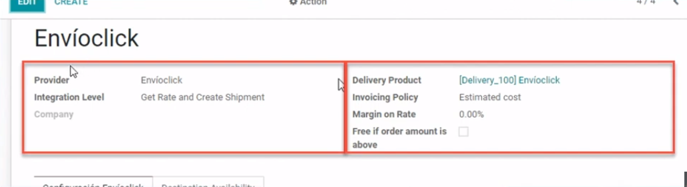
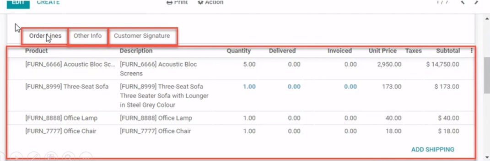
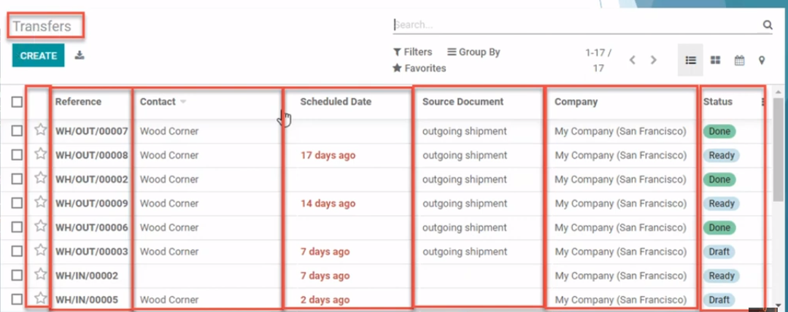
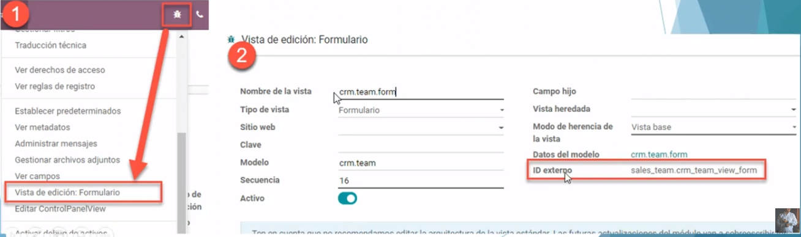

# Curso_de_Programación_Odoo

<h2>Content List</h2>

- [Qué se Debe Saber del DESARROLLO Odoo](#qué-se-debe-saber-del-desarollo-odoo)
- [Arquitectura y Estructura básica de una app en Odoo](#arquitectura-y-estructura-básica-de-una-app-en-odoo)
- [Módelos Python para Aplicaciones Odoo](#módelos-python-para-aplicaciones-odoo)
- [Vistas XML para Aplicaciones Odoo](#vistas-xml-para-aplicaciones-odoo)
- [Herencia en Odoo](#herencia-en-odoo)
- [Herencia en Odoo Vistas XML](#herencia-en-odoo-vistas-xml)
- [Ícono en el Módulo](#ícono-en-el-módulo)
- [Modo Debug o Modo Desarrollador](#modo-debug-o-modo-desarrollador)
- [Buenas Práctias de Programación en Odoo](#buenas-práctias-de-programación-en-odoo)
- [Cómo Utilizar Odoo Runbot para Community | Ambiente para Pruebas](#cómo-utilizar-odoo-runbot-para-community--ambiente-para-pruebas)


## Qué se debe saber del DESAROLLO Odoo 

* ¿Qué hace un desarrollador Odoo?
    * Aplicaciones y /o funcionalidades nuevas: Crear un módulo nuevo con funcionalidades nuevas en el ERP 
    * Adecuación y/o ajustes a funcionalidades existentes: Ya viene empaquetado con ciertas funcionalidades, es decir que de acuerdo a un requimrimiento se realicen cambio a las funcionalidades de ese módulo 
    * Corrección de errores: Es muy probable que algún desarrollo no funcione correctamente. 
    * Reportes 
* ¿Qué conocimientos se necesita?
    * Saber programar y/o tener lógica de programación 
    * No se requiere conocer o dominar python 
* Conocimiento básico de SQL y base de datos
    * En Odoo rara vez se requerirá una consulta SQL 
    * Dominar la lógica en las sentencias SQL te ayudará a entender los dominios en Odoo. 
* Lenguajes de programación que se utilizan
    * Python
    * Xml
    * Javascript
    * Otros no tan usados
        * CSS
        * HTML
* La base de datos que se utiliza es PostgreSQL
* Se utiliza el ORM de Odoo para la interacción con la base de datos
* Sistema Operativo con Linux en alguna de sus distribuciones
    * Ubuntu 20.04 o superiores
* Editor de código o IDE
    * Visual Studio Code
*  Repositorio para control de versiones de código: GITHUB
* Compatibilidad con navegadores web

<h3>Consejos</h3>

* Seguir las buenas prácticas de programación 
* Sigue los lineamientos para desarrollar en Odoo 
* Conoce y aplica las convenciones de programación para python y Javascript
* Apoyate del código estándar para realizar el tuyo
* Versiona tu código con la ayuda de GitHub
* Entiende y comprende los conceptos básicos: Modelos, Campos, Vistas, Widgets
* Practica para fortalecer tu habilidad de desarrollo 
* Mantente actualizado con las nuevas novedades, versiones, widgtres, etc de Odoo 
* Sé autodidacta pero no dejes de formarte
* Capacitate

## Arquitectura y Estructura básica de una app en Odoo 

<h3>Composición de un módulo</h3>

* Objetos de negocio. Declaradas con clases Python
* Vistas de objetos: Visualización de la interfaz de usuario, declardos con archivos XML. 
* Archivos de información. 
    * Informes
    * Datos de configuración 
    * Datos de demostración
    * Y más... 
* Controladores web: Maneja solicitudes de nacegadores web 
* Datos web estáticos. Utilizados por el sitio o interfaz web 
    * Imágenes
    * Archivos CSS 
    * Javascript

<h3>Arquitectura similar a MVC</h3>

<p align="center"></p>

<h3>Estructura de una Aplicación Odoo</h3>

<p align="center"></p>

<h3>Archivo __init__.py</h3>

En este archivo se indicará donde se encuentran los archivos .py 

El archivo init se verá así 

```python
from . import controllers
from . import models
from . import wizards
```

Controllers, models y wizards son carpetas que creamos en nuestro proyecto. 

Dentro de las carpetas, también existe un fichero __ init __.py Y este fichero hace exactamante lo mismo, sólo que dentro de esa carpeta, es decir localiza los archivos .py e importa todos los registros que estén dentro de esa carpeta. 

<h3>Archivo __manifest__.py</h3>

Se encuentra en la carpeta principal  y nos indica donde se encuentran los archivos xml, csv y otras fuentes.

**¿Para qué sirve?**

Ene ste archivo podemos hacer la declaración de módulo y especificación de metadatos del módulo, como por ejemplo, el nombre de la alicación, descripción, sitio web de creador y de autor, versión de la aplicación del módulo, la dependencia con otros módulos, fuentes: vistas, datos, imágenes; licencia, etc. 

## Módelos Python para Aplicaciones Odoo 

<h3> Objetos de Negocio: Modelos Odoo </h3>

* Los módelos decriben objetos de negocio: Clientes, proveedores, productos, compras, etc 
* Cada modelo en odoo es declarado como una clase en python. 
* Un modelo tiene una lista de atributos y también puede definir su propia lógica de negocio. 

<p align="center"></p>

<h3>Estructura de un Modelo</h3>

* La clase se define con **class** y se utiliza mayúscula al principio de cada palabra. 
* El nommbre del modelo se define con **_name**.
* Los campos se definen con **fields**
* Los campos se definen como atributos en la clase del modelo y definen qué puede almacenar el modelo y dónde. 

<p align="center"></p>

De acuerdo al código, tenemos: 

```python
from odoo import models, fields     #Para lograr acceso a los componentes del models 

class NombreClase(models.Model):    #Declaración de la clase y se declara que sea de tipo model
    _name = 'nombre.modelo'         #Nombre del módelo

    campo1 = fields.Char()          #Campos que están dentro del módelo 
    campo2 = fields.Char()
    campo3 = fields.Char()
    campo4 = fields.Char()

    def metodo1(self):              #Finalmente, declaramos los métodos del módelo
        return self

    def metodo2(self)
        return self
```

<h3>Persistencia de datos en los Modelos</h3>

* En Odoo existe una capa de Mapeo de Objeto-Relación o ORM por sus siglas en inglés 
* El ORM de Odoo traduce instrucciones python a sentencias SQL. 
* el ORM evita escribir la mayoría de sentencias SQL y proporciona servicios de extensibilidad y seguridad
* El modelo se convierte en una tabla
* Los campos se convierten en columnas de una tabla. 

<p align="center"></p>

<h3>Tipos de Modelo</h3>

* Los módelos de Odoo se crean heredando a ***Model,TransientModel*** o ***AbstractModel***
    * Model: Modelos regulares de BD persistentes. 
    * TransientModel: Datos temporales, almacenados en BD y automáticamente borrados de vez en cuando. 
    * AbstractModel: Sin tablas de BD vinculados a ellos. Compartidas por múltiples modelos heredados. 

## Vistas XML para Aplicaciones Odoo 

<h3>La Capa de Vista Odoo</h3>

* La capa de vista decribe la interfaz visual de usuario
* LAs vistas se definen mediante archivos XML que son utilizados por el marco del cliente web para generar vistas HTML con datos. 
* En los archivos XML se definen acciones y menús. Estos son instancias de ir.ui.view. 
* Toda vista en Odoo debe estar referenciada en el archivo __ manifest __.py en la sección data, de lo contrario Odoo no lo tomará en cuenta. 
* un mismo módelo puede tener más de una vista. 
* Existen diferentes tipos de vistas en Odoo que nos sirve para organizar nuestros campos fields de una forma lógica:
    * Vistas de tipo lista
<p align="center"></p>    
    * Vistas de tipo formulario
<p align="center"></p>
    * Vista de tipo pivote
<p align="center"></p>
    * Vista de tipo kanban
<p align="center"></p>
    * Vista de tipo búsqueda
<p align="center"></p>

<h3>Estructura de una Vista</h3>

* iniciamos con el tag 
```xml 
<?xml version="1.0" encoding="utf-8"?>
```
* Nuestra vista debe encontrarse entre el tag de 
```xml
<odoo></odoo>
```
* La vista se define con el tag 
```xml
<record>
``` 
al que se le tiene que especificar un **id** y el modelo **ir.ui.view**. Para el id anteponemos la palabra view, seguido del nombre del modelo y posteriormente el tipo de vista, separados por guion bajo. Ejemplo: view_nombre_modelo_tipovista.
* Se debe especificar un nombre y un modelo esto se hace con los tag 
```xml
<field></field>
```
* Se especifica el cuerpo de la vista indicando que se trata de un archivo xml 

La estructura de la vista quedará de esta manera: 

```xml
<?xml version="1.0" encoding="utf-8"?>
<odoo>

    <record id="view_nombre_modelo_tipovista" model="ir.ui.view">
        <field name="name">nombre.modelo.tipovista</field>
        <field name="model">nombre.modelo</field>
        <field name="arch" type="xml">
            <!-- AQUÍ EL CONTENIDO DE LA VISTA -->
        </field>
    </record>

</odoo>
```
<h3>Estructura de un Formulario</h3>

* Para declarar un forulario se utiliza el tag 
```xml
<form></form>
```
Se puede indicar un string como título del formulario. 
* Se colocarán los botones y el widget de barra de estatus en la sección 
```xml
<header></header>.
```
* Los botones se declaran con 
```xml
<button name="nombre_funcion_python" string="Texto del boton" type="object">
```
* Los campos de estatus deben declarar con el nombre state y se utiliza el widget de barra de estaus: 
```xml
<field name="campo_estatus" widget="statusbar" readonly="1"/>
```

Continuando con el archivo XML, se introducen las líneas de la siguiente forma: 
```xml
        <field name="arch" type="xml">
            <!-- AQUÍ EL CONTENIDO DE LA VISTA, EN ESTE CASO VISTA FORMULARIO -->
            <form string="Titulo formulario">

                <header>

                    <button name="nombre_funcion_python" string="Texto del boton" type="object">
                    <field name="campo_estatus" widget="statusbar" readonly="1"/>

                </header>
            </form>
        </field>
```
<p align="center"></p>

<h3>Contenido de un formulario(sheet)</h3>

* Agregar el contenido del formulario entre los tag de 
```xml
<sheet></sheet>
```
* Se puede utilizar el tag 
```xml
<group></group>
```
Para organizar los campos dentro del formulario. Esta etiqueta inserta dos columnas y en su interior los campos se mostrarám con etiqueta. 
* Un campo y su respectiva etiqueta ocuparán dos columnas. Si dentro de group agreagamos dos secciones más de group tendremos dos columnas de campos con su respectia etiqueta. 
* El contenido del formulario se utilizan el tag **field** para colocar un campo del modelo. El campo atributo **widget** es opcional. 

```xml
<sheet>
    <!-- Contenido dividido en dos columnas. Campos con etiquetas -->
    <group>

        <!-- Contenido de la columna izquierda -->
        <group>
            <field name="nombre_campo" widget="nombre_widget"/>
        </group>

        <!-- Contenido de la columna derecha -->
        <group>
            <field name="nombre_campo2"/>
        </group>

    </group>
</sheet>
```
<p align="center"></p>

<h3>Estructura de un formulario (NoteBook)</h3>

* Se llaman libretas de notas con pestañas y se utilizan para organizar un gran número de campos por tema. 
* El elemento notebook convierte las secciones en pestañas llamadas páginas. 
* Para agregar una libreta de notas con pestaña se utiliza el tag de 
```xml
<notebook></notebook>
```
* Para agregar una página se utiliza el tag 
```xml
<page></page>
```
Para el título de la página o pestaña se utiliza el atributo **String** mientras que para asginarle un nombre se utiliza el atributo **name**. 

```xml
<!-- Contenido agrupado en páginas o pestañas -->
<notebook>

    <page string="Titulo página (pestaña) 1" name="nombre_pagina">
        <!-- Contenido de la página 1 -->
    </page>

    <page string="Titulo página (pestaña) 2">
        <!-- Contenido de la página 2 -->
    </page>

</notebook>
```

<p align="center"></p>

<h3>Estructura de una Vista</h3>

* Iniciamos con el tag
```xml
<?xml version="1.0" encoding="utf-8"?>
```
* Nuestra vista ebe encontrarse entre el tag de 
```xml
<odoo></odoo>
```
* La vista se define con el tag 
```xml
<record>
```
al que se tiene que especificar un **id** y el modelo **ir.ui.view**. Para el id anteponemos la palabra view, seguido del nombre del modelo y posteriormente el tipo de vista, separados por guion bajo. Ejemplo: view_nombre_modelo_tipovista. 
* Se debe especificar un nombre y un modelo esto se hace con los tag 
```xml
<field></field>
```
* Se especifica el cuerpo de la vista indicando que se trata de un archivo xml 

La estructura de la vista quedará de esta manera: 

```xml
<?xml version="1.0" encoding="utf-8"?>
<odoo>

    <record id="view_nombre_modelo_tipovista" model="ir.ui.view">
        <field name="name">nombre.modelo.tipovista</field>
        <field name="model">nombre.modelo</field>
        <field name="arch" type="xml">
            <!-- AQUÍ EL CONTENIDO DE LA VISTA -->
        </field>
    </record>

</odoo>
```

<h3>Estructura de una lista</h3>

* Para las vistas de tipo lista se utiliza el tag 
```xml
<tree></tree>
```
* Dentro del elemento tree se declaran los campos con la etiqueta 
```xml
<field>
```
* Cada elemeto field representará una columna en la tabla 

```xml
<?xml version="1.0" encoding="utf-8"?>
<odoo>

    <record id="view_nombre_modelo_tipovista" model="ir.ui.view">
        <field name="name">nombre.modelo.tipovista</field>
        <field name="model">nombre.modelo</field>
        <field name="arch" type="xml">
            <!-- AQUÍ EL CONTENIDO DE LA VISTA -->

            <tree>

                <!-- Contenido a manera de columnas -->
                <field name="nombre_campo"/>
                <field name="nombre_campo2"/>

            </tree>
            
        </field>
    </record>

</odoo>
```
<p align="center"></p>

## Herencia en Odoo

* Nunca se debe modificar el código estándar de Odoo. 
* En lugar de sobre escribir vistas o modelos existentes, Odoo nos proporciona mecanismos para heredarlos y así extenderlos de forma modular. 
* Las herencias se utilizan para cambiar, agregar o elimiar funcionalidades existentes. Estas modificaciones pueden ser a nive modelo, vista o lógica de negocio. 
* En el archivo __ manifest __.py, en la sección **depends** se deberá indicar los módulos o aplicaciones que contienen nuestros modelos heredados.

<h3>Herencia de modelos en Odoo(_INHERIT)</h3>

* En el modelo, se sustituye la palabra reservada _name por la palabra reservada **_inherit** en la clase.
* El nombre del modelo que se declare  con _inherit debe ser un modelo ya existente. 
* Con la herencia se puede lograr: 
    * Agregar campos nuevos a un modelo existente
    * Anular la definición de campos de un modelo existente
    * Agregar restricciones o funcionalidades adicionales a un modelo existente 
    * Agregar métodos y funcionalidades nuevas a un modelo existente
    * Anular métodos o procesos a un modelo existente. 

En código, se representa así: 

```Python 
from odoo import models, fields, api

class NombreClase(models.Model):

    _inherit = 'modelo.a.heredar'

    campo adicional = fields.Char()
```

<h3>Herencia de Modelos en Odoo (Métodos)</h3>

* Una vez en un modelo heredado se puede sobreescribir por completo un método 
* Para sobreescribir un método basta con agregar el nombre del método con la misma cantidad de parametros que el método original 
* Dentro del método se puede invocar a la funcionalidad original hablando al método de la super clase. Para ello se utiliza **super(NombreClase,self).método_original()**

en código se representa así: 

```Python 
from odoo import models, fields, api 

class NombreClase(models.Model):

    _inherit = 'modelo.a.heredar'

    campo_adicional = fields.Char()

    #===================================================================#
    #   METODO_ORIGINAL(SELF)                                           #
    #   Método original en el modelo heredado 'modelo.a.heredar'        #
    #===================================================================#

    def metodo_original(self):
        # Agregar aquí funcionalidad adicional si así es requerido
        
        # Invocara método original de la superclase 'modelo.a.heredar'
        res = super(NombreClase,self).metodo_original()

        # Agregar aquí funcionalidad adicional si así es requerido

        return res
```

## Herencia en Odoo Vistas XML

<h3>Herencia en Odoo</h3>

* Nunca se debe modificar código estándar de Odoo 
* en lugar de sobreescribir vistas o modelos existentes, Odoo nos proporciona mecanismos para heredarlos y así extenderlos de forma modular. 
* Las herencias se utilizan para cambiar, agregar o eliminar funcionalidades existente. Estas modificaciones pueden ser a nivel modelo, vista o lógica de negocio. 
* En el archivo __ manifest __.py, en la sección **depends** se deberá indicar los módulos o aplicaciones que contienen nuestros módelos. 

<h3>Herencias de Vistas en Odoo</h3>

* Para heredar una vista se agrega el tag **inherit_id** donde se indica el id de la vista que se desea heredar. Por ejemplo: 
```xml
<field name="inherit_id" ref="id_de_vista_a_heredar"/>
```
* Para obtener el id de la vista que se desea heredar se activa el modo debug, posteriormente se dirige a la vista que se desea heredar y se selecciona el menú **Vista de edición**
* Se abrirá un modal del cual podemos ver nuestro id en el campo. 

<p align="center"></p>

* Dentro de la sección **arch** se puede colocar tantos tags **xpath** como se deseen
* Los elementos **xpath** permiten seleccionar y alterar contenido de la vista padre
* En el atributo **expr** del tag xpath se selecciona el elemento de la vista. Este debe existir o de lo contrario marcará error. 
* Para localizar un elemento con **xpath** declarado como: **< field name="descripción" />** se usa **//field[@name="descripción"].**
* Para localizar un elemento **xpath** declarado como **< page string="Titulo página (pestaña) 1" name="nombre_pagina" >** se usa **//page[@name="nombre_pagina"]**
*  Para localizar un elemento con **xpath** declarado como **< button name="button_confirm" type="object" string="Confirm Order" id="draft_confirm"/>** se usa **//button[@id="draft_confirm"].
* En el atributo position es la operación que se aplica al elemento encontrado. Puede tener diferentes valores: 
    * inside. Dentro del elemento encontrado
    * Replace. Reemplazará el elemento encontrado con el que se especifique
    * Before. Colocará el nuevo elemento antes
    * After. Colocará el nuevo elemento después. 
    * Attributes. Modificará los atributos del elemento encontrado.
    
El código es así: 
```xml
<?xml version="1.0" encoding="utf-8"?>
<odoo>

    <record id="view_nombre_modelo_tipovista" model="ir.ui.view">
        <field name="name">nombre.modelo.tipovista</field>
        <field name="model">nombre.modelo.a.heredar</field>
        <field name="inherit_id" ref="id_de_vista_a_heredar"/>
        <field name="arch" type="xml">
            <!-- Busca el campo descripción y agrega campo_nuevo posicionandolo después del campo descripción -->

            <xpath expr="//field[@name='descripción']" position="after">
                <field name="campo_nuevo" string="Campo nuevo"/>
            </xpath>
            
        </field>
    </record>

</odoo>
```

## Ícono en el Módulo 

* Cada módulo o aplicación en Odoo puede o no tener un ícono 
* El ícono en los módulos o aplicaciones de odoo no tienen otra función más que facilitar su reconocimiento dentro del listado de aplicaciones 
* El ícono deseablemente debería ser cuadrado y de tamaño 140 x 140 píxeles 
* El nombre del ícono deberá ser icon y su extensión png 
    * **icon.png**
* Si deseamos agregar un ícono a nuestro módulo debemos agregarlo a la ruta **static/description**
* Odoo reconocerá la imagen y la mostrará como ícono de nuestro módulo

## Modo Debug o Modo Desarrollador

* Qué es el modo debug o modo desarrollador ? 
    * Es una funcionalidad que nos ofrece Odoo para acceder a las herramientas adicionales y avanzadas del modo desarrollador
* Cómo activo el modo debug o modo desarrollador ? 
    * Mediante ajustes -> Nos dirigimos a ajustes/opciones generales y al final estará el boton de activar modo desarrollador
    * Mediante URL -> Seguido de la palabra web, sin espacios ponemos ?debug=1 Para desactivar el modo desarrollador, se cambia 1 por 0 
    * Mediante plugin en navegador. -> Se instala la extensión del navegador
* Qué ofrece la activación del modo debug o modo desarrollador ? 
    * Herramientas adicionales que son útiles para comprender o editar datos técnicos, como las vistas o las acciones
    * Visualización de campos, botones, menús ocultos 
* Quiénes usan y para qpe usar el modo debug o desarrollador? 
* Cómo sacarle mejor provecho ? 
    * Editar acción 
    * Ver campos ténicos 
    * Administrar o gestionar filtros
    * Traducción técnica 
    * Editar la vista actual 
    * Editar el ControlPanelView u opciones de filtrado en el panel de búsqueda

## Buenas Práctias de Programación en Odoo 

* Comenta tu código python 
    * Usa comentarios en tu código Python y XML 

    ```python                                                     
    variable = self # Aquí puedo usar # para comentar código

    # Este es un comentario en python 
    # y puedo poner otro # para escribir otra línea

    """ Este es un comentario de muchas líneas
    aunque no importa si usamos una sola """
    ```

    ```xml
    <!-- Este es un comentario en XML -->
    ```

    * Documenta los métodos 

    ```python
    def metodo(self, parametro1, parametro2):
        ''' Descripción de lo que hace el método y/o lo que retorna 

        :param parametro1: Explicación del tipo de valor que recibe y para qué se usa el parámetro
        :param parametro2: Explicación del tipo de valor que recibe y para qué se usa el parámetro
        :rtype: Tipo de dato que se retorna
        :return: Explicación del o los valores devueltos        
        '''
    ```

    * Documenta las validaciones complejas

    ```python 
    # 1) Describe lo que hace el código

    invoice_vals_list = []

    for order in self: 
        order = order.with_company(order.company_id)
        # Explica para qué servirá o qué significa la variable creada
        invoice_vals = order._prepare_invoice()
        # Explica el código y la razón de porqué se hace 
        for line in order.order_line:
            ...
            ...
    
    # 2) Describe lo que hace el código (Paso 2)
    #Más información para entender el código 
    #Describe variables, ciclos, consultas, etc
    new_invoice_vals_list = []
    ```

    * Comenta las secciones importantes en el código xml 

    ```xml
    <!-- Descripción de la sección -->
    <menuitem id="menu_purchase_products" name="Products" parent="purchase.menu_something">
    ```

    * Elimina comentarios basura 
    * Elimina campos y/o variables comentados que no son utilizados
    * Borra ficheros XML  o Python donde todo el código esté comentado y no aporte nada
        * Utilizar instrucciones scaffold se nos crean ficheros comentados 

## Cómo Utilizar Odoo Runbot para Community | Ambiente para Pruebas 

Ingresamos a su url https://runbot.odoo.com

Runboot son ambientes de prueba, los cuales ya tienen módulos completamente cargados, en los cuales se pueden ejecutar todas las pruebas corresponientes. 

## Campos Automáticos Creados por Odoo 

* Cuando un modelo se crea en Odoo, se crea unos campos de manera automática. 
* Estos campos los administra el sistema y no se pueden escribir
* Podemos consultar y leer estos campos en caso de ser necesario
* Se actualizan automáticamente si **_log_access** del módulo está habilitado (no aplica para el id)
* Se pueden deshabilitar para evitar crear o actualizar aquellos campos en tablas para los que no son útiles
* De forma predeterminada, **_log_access** se establece en el mismo calor que tenga **_auto** y este de manera predeterminada se establece en **True**
* **id**
    * El identificaror único para un registro del modelo
    * No depende de **_loag_access** 
* **create_date**
    * Fecha de cuando se creó el registro, 
    * Es de tipo Datetime
* **create_uid**
    * Usuario quién creó el registro,
    * Es de tipo Many2one del modelo res.users
* **write_date**
    * Última fecha de modificación del registro
    * Es de tipo Datetime 
* **write_uid**
    * Usuario que modificó por última vez el registro 
    * Es de tipo Many2one del modelo res.users


